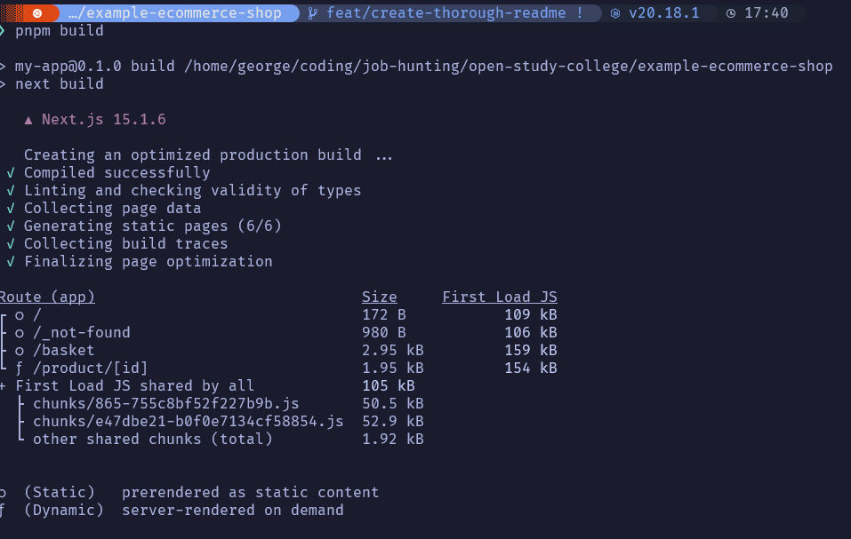

# Example Ecommerce Shop

This is an example ecommerce shop built with Next.js and Tailwind CSS.

## Overview

The project is a simple e-commerce store with a homepage, product page, and a basket. It uses Next.js for the frontend and a [mock.shop api](https://mock.shop) for the backend.

A user can browse the products in the trending section on the homepage, go to the product page and add and remove items from the basket.

A user can also view the total price of the items in the basket and clear and adjust the quantity of items in the basket on the basket page.

## Deployment

You can see an example deployment of this project [here](https://example-ecommerce-shop.vercel.app/).

## Setup Instructions

This is a [Next.js](https://nextjs.org) project bootstrapped with [`create-next-app`](https://nextjs.org/docs/app/api-reference/cli/create-next-app).

1. You need to ensure you have [Node.js](https://nodejs.org/en/download/) installed. At least version 20.x.

2. You need to ensure you have [pnpm](https://pnpm.io/) installed.

3. Once you have everything installed, run the following command to install the dependencies:

```bash
pnpm install
```

4. to start the development server, run the following command:

```bash
pnpm dev
# or
```

Open [http://localhost:3000](http://localhost:3000) with your browser to see the result.

This project uses [`next/font`](https://nextjs.org/docs/app/building-your-application/optimizing/fonts) to automatically optimize and load [Geist](https://vercel.com/font), a new font family for Vercel.

## Testing

To run the tests, run the following command:

```bash
pnpm test
```

If I had more time, I would've configured coverage reports and even considered user [playwright](https://playwright.dev/) for e2e testing.

Obviously I wouldn't written more tests as well.

## Technical Descisions and Resasoning

### Framework

I chose React and Next.js for the frontend as I am familiar with those technologies and they allowed me to iterate quickly and fullfill the requirements quickly.

The reason I chose Next.js was due to it's ability to do SSR and SSG. Along with other features like partial-prerendering, Great SEO and Metadata tools, Built-in routing and Image Optimization etc.

If I had more time I would've delved into using remix or shopify hydrogen as these tools are more suited for the e-commerce space (with regards to shopify) and have first class support with Headless Shopify storefronts.

### Langauge

TypeScript due to it's type safety and when looking at the Testing pyramid one of the first ways to protect and write better code is having stronger types.

### Styling

I've used SCSS and styled-components before for styling Frontend applications. I chose to use Tailwind CSS as I find I can iterate much more quickly using Tailwind and I find it's a great fit for libraries and frameworks that are built around the premise of using components.

Plus it means I'm spending less time going back and forth between different files.

### State Management

I've used Zustand and Redux (Along with redux toolkit) before for state management. I find Zustand has a much simpler API, which leads to faster development at least for myself. 

With regards to managing async state, I often find my self reaching for tanstack query (again due to the api being easier to work with). But due to using Next.js the async state management is managed by the framework rather than through another library.

I often only reach for Tanstack query when creating a full SPA application.

## Routing

This project uses Next.js's built-in routing.

Again if I were using Remix or Hydrogen I would've used their routing tools.

I'm familiar with React Router and I still really like it. I've very much appreciated the transformation it's had since upgrading to v7.

## Accessibility

I've used ShadCN as I was using tailwind anyway. This is built on top of Radix UI and I've found between Radix UI and React Aria these cover a lot of the points with regards to accessiblity (making sure aria attributes are used correctly, components are accessible and tabable etc).

I've tested the application using lighthouse to check for accessiblity issues and on the home page it's at 100%.

Obviously if I had more time I would've used a more comprehensive accessibility testing tool. For instance I'd use [axe](https://www.deque.com/axe/) or something similar.

## Testing

I've used vitest and react testing library for testing. These are pretty much the standar for unit and inegration testing for frontends and backends in the JavaScript/TypeScript ecosystem.

I've set up a mock service so that I can easily use test components when they're using a zustand store.

If I had more time I would've fully tested all the components and the store. Futhermore I would've setup and configured playwright for end to end testing.

## Performance

Again I ran a bunch of lighthouse tests in incognito mode and the performance is sitting in the high 90s.

If I had more time I would consider code splitting and lazy loading however the chunks are very small as is and the First Load for JS is relatively small at 154 kb max for the largest page (basket page which is a heavier client side component).

Here's the build data if you're interested:




## Imrpovements

I think I've covered these throughout the rest of the readme. But happy to discuss more in detail in person